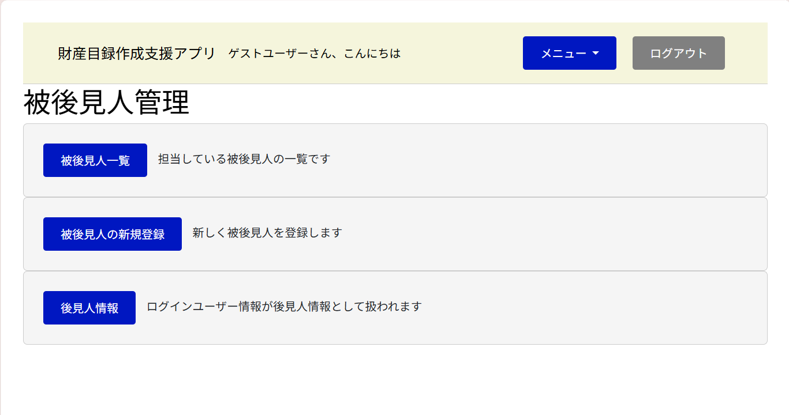

# 財産目録作成支援アプリ

> **後見人の財産目録作成を支援するWebアプリ**

成年後見人が家庭裁判所へ提出する**財産目録**の作成を支援するWebアプリケーションです。
財産情報を管理し、家庭裁判所の様式を意識したCSV形式で出力できます。

<p align="center">
  <!-- サービスのトップ画面の画像を配置 -->
  
</p>

---

# 🌐 サービスURL

https://kouken-report-app.onrender.com/

> **Renderの無料プランで公開しているため、初回アクセス時は起動まで30秒～1分程度かかる場合があります。**

---

# 📖 サービス概要

本サービスは、成年後見人が家庭裁判所へ提出する財産目録の作成を支援するWebアプリケーションです。

財産情報を登録・管理し、CSV形式で出力することで、紙や表計算ソフトで管理する手間を軽減し、財産目録作成業務の効率化を目的としています。

---

# 💡 開発背景

高齢化が進む日本では、成年後見制度の利用者が増加しており、今後は制度改正によってさらに利用が広がることが想定されています。

その一方で、後見人は財産目録の作成や管理など、多くの事務作業を担っています。

こうした負担を少しでも軽減したいという思いから、Web上で財産情報を管理し、家庭裁判所へ提出する財産目録を効率よく作成できるサービスを開発しました。

---

# ✨ 工夫したポイント

### 📄 家庭裁判所の様式に対応したCSV出力

家庭裁判所へ提出する財産目録を想定し、CSV出力時のフォーマットを実際の様式に合わせて調整しました。

利用者がダウンロード後も扱いやすいよう、列の並びや項目名を意識して実装しています。

### 🎨 シンプルで迷わないUI

利用者には幅広い年代の後見人を想定し、直感的に操作できる画面を目指しました。

デザインはマイナポータルを参考に、落ち着いた色合いとシンプルなレイアウトを採用しています。

### 👤 ユーザーごとのデータ管理

ログインユーザーごとに財産情報を管理できるよう実装しています。

他のユーザーのデータにはアクセスできないよう関連付けを行い、それぞれが自分のデータのみを閲覧・編集・CSV出力できる設計としています。

---

# ⚡ 開発で苦労したこと

今回が本格的なWebアプリケーション開発だったため、多くの機能で試行錯誤を重ねました。

特にJavaScriptが思いどおりに動作しない場面では、原因の特定に時間がかかり、公式ドキュメントや技術記事を参考にしながら一つずつ解決しました。

また、CSV出力では家庭裁判所の財産目録の様式に合わせる必要があり、項目や出力順を確認しながら何度も調整を行いました。

この開発を通して、エラーの原因を調査しながら解決する力や、実務を意識した機能を実装する経験を得ることができました。

---

# 📱 主な機能

| 機能     | 内容                      |
| ------ | ----------------------- |
| ユーザー登録 | メールアドレス・パスワードによるアカウント作成 |
| ログイン   | ユーザー認証                  |
| 財産情報登録 | 財産情報の登録・管理              |
| CSV出力  | 家庭裁判所の様式を意識したCSVダウンロード  |

※ここに各機能のスクリーンショットを追加すると、より分かりやすくなります。

---

# 🛠 使用技術

| カテゴリ            | 技術                      |
| --------------- | ----------------------- |
| Backend         | Ruby on Rails           |
| Database        | SQLite3                 |
| Frontend        | HTML / CSS / JavaScript |
| Deploy          | Render                  |
| Version Control | Git / GitHub            |

---

# 📊 ER図

ER図をここに貼り付けます。

```text
（ER図の画像）
```

---

# 🏗 インフラ構成図

インフラ構成図をここに貼り付けます。

```text
（構成図の画像）
```

---

# 🚀 今後の展望

* 入力内容のバリデーションを充実させ、入力ミスを防止する
* CSVの出力形式をさらに家庭裁判所の運用に合わせて改善する
* PDF形式での帳票出力機能を追加する
* 検索・絞り込み機能を追加する
* UI/UXを改善し、より使いやすい画面にする
* テストコードを追加し、品質を向上させる
