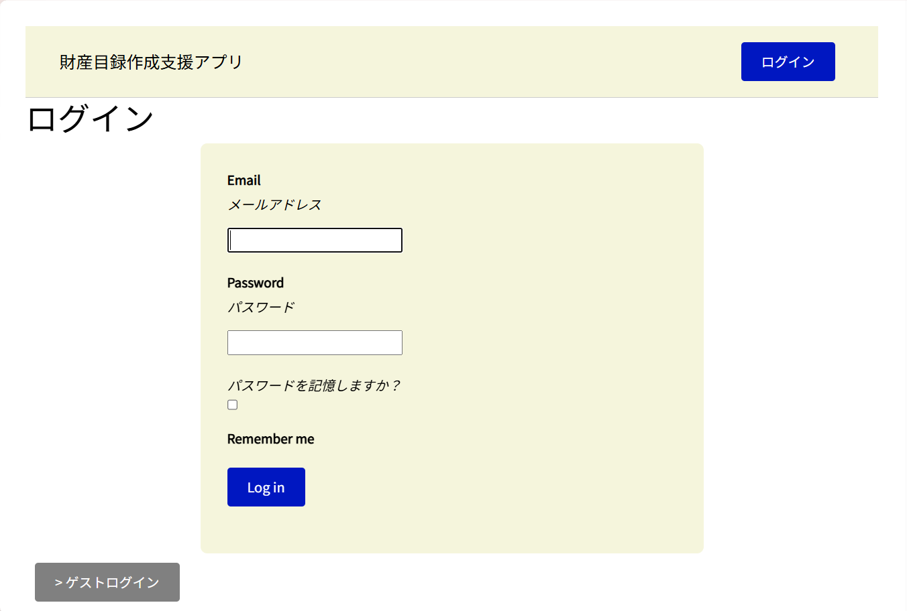
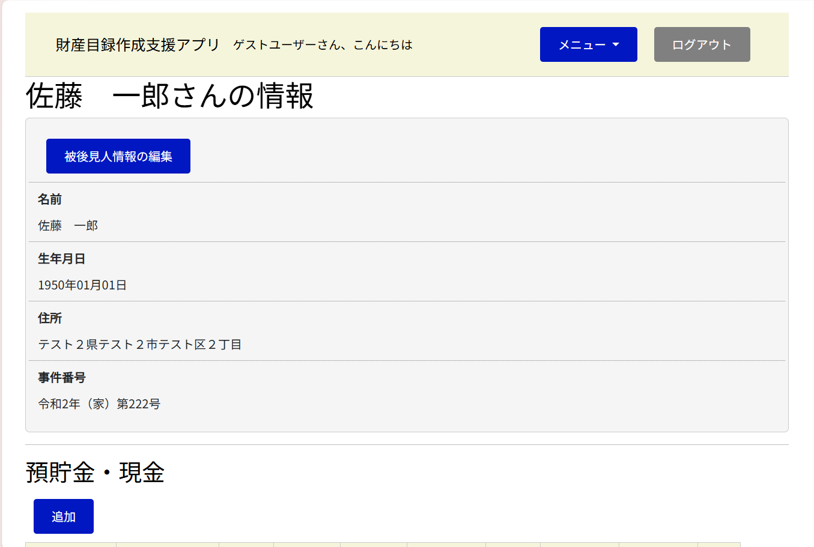
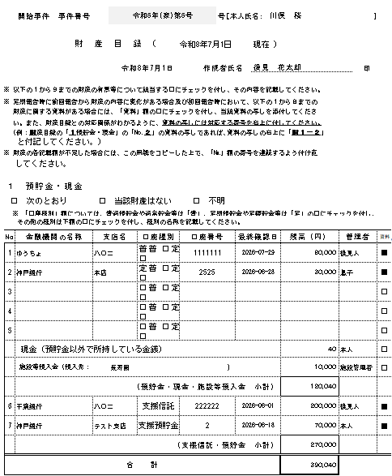
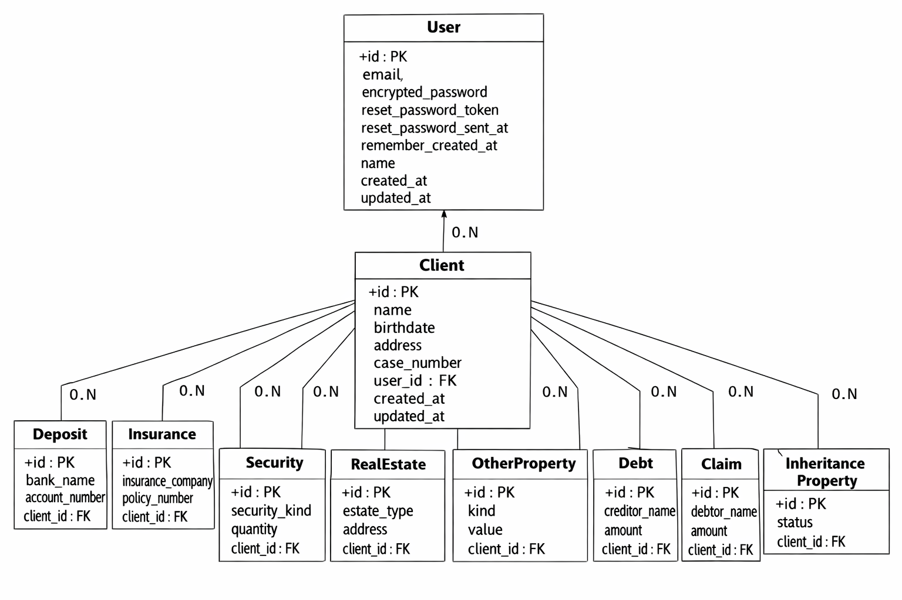
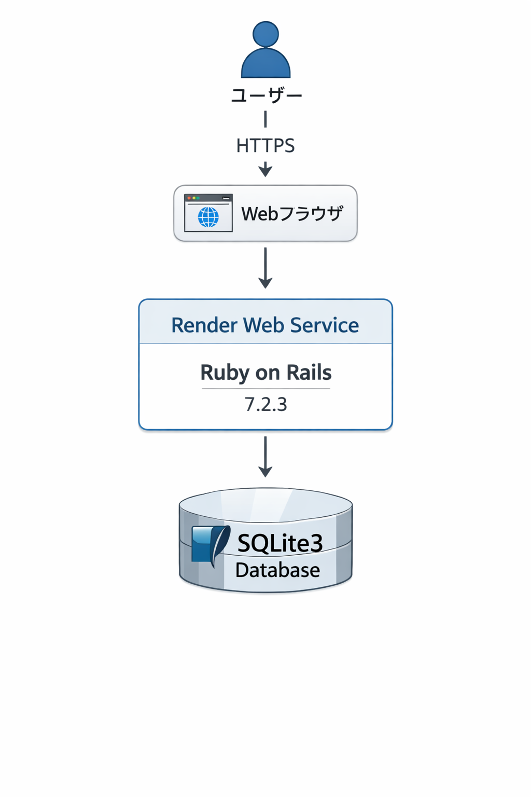

# 財産目録作成支援アプリ

> **後見人の財産目録作成を支援するWebアプリ**

  

---

## 🌐 サービスURL

https://kouken-report-app.onrender.com/

※ Renderの無料プランを利用しているため、初回アクセス時は起動まで時間がかかる場合があります。

---

# 📖 サービス概要

本サービスは、成年後見人が家庭裁判所へ提出する**財産目録の作成を支援するWebアプリケーション**です。

財産情報をWeb上で管理し、家庭裁判所へ提出する財産目録を想定したCSV形式で出力することで、作成業務の効率化を目的としています。

紙や表計算ソフトで管理する場合に発生する入力や整理の負担を軽減し、後見人の事務作業をサポートします。

---

# 💡 開発背景

日本では高齢化が進み、成年後見制度を利用する方が増加しています。

また、成年後見制度については今後も見直しや法改正が予定されており、単身高齢者の増加などを背景に、福祉分野における業務効率化の必要性はさらに高まっています。

成年後見人が行う業務の中でも、財産目録の作成は重要な事務作業の一つですが、多くの情報を整理する必要があり負担も大きい作業です。

そこで、財産情報をWeb上で管理し、財産目録作成を支援できるサービスを開発しました。

---

# ✨ 工夫したポイント

## 📄 家庭裁判所の様式に対応したCSV出力

財産目録は家庭裁判所へ提出する書類であるため、出力するCSVのフォーマットを実際の提出様式を意識して調整しました。

利用者がダウンロード後に活用しやすいよう、項目名や列の順番を合わせ、実務での利用を想定した出力形式にしています。

---

## 🎨 シンプルで迷わないUI設計

成年後見制度を利用する方や後見人には幅広い年代の利用者が想定されるため、迷わず操作できることを重視しました。

画面デザインはマイナポータルを参考に、落ち着いた色合いとシンプルなレイアウトを採用し、必要な情報へアクセスしやすいUIを目指しました。

---

## 👤 ユーザーごとのデータ管理

ログインユーザーごとに財産情報を管理できるよう実装しています。

ユーザーと財産情報を関連付けることで、他のユーザーのデータへアクセスできないようにし、自分の登録した情報のみ管理できる設計としています。

---

# ⚡ 開発で苦労したこと

今回が初めて本格的にWebアプリケーションを開発する経験だったため、実装の多くの部分で試行錯誤を繰り返しました。

特にJavaScriptが意図した通りに動作しない問題では、原因を特定するためにコードの確認や調査を行い、一つずつ解決していきました。

また、家庭裁判所の財産目録様式に合わせたCSV出力では、必要な項目や出力形式を確認しながら調整を行いました。

エラーが発生した際には、公式ドキュメントや技術記事を参考に原因を切り分け、問題解決を進めることで、実装力や調査力を身につけることができました。

---

# 📱 主な機能

| 機能     | 内容                     |
| ------ | ---------------------- |
| ユーザー登録 | Deviseを利用したアカウント作成     |
| ログイン   | ユーザー認証機能               |
| 財産情報管理 | 財産情報の登録・管理             |
| CSV出力  | 家庭裁判所の様式を意識したCSVダウンロード |

---

# 🖥️ 画面紹介

## ログイン画面

  

---

## 財産情報登録画面

  

---

## CSV出力画面

  

---

# 🛠 使用技術

| カテゴリ            | 技術                      |
| --------------- | ----------------------- |
| Backend         | Ruby on Rails 7.2.3     |
| Database        | SQLite3                 |
| Frontend        | HTML / CSS / JavaScript |
| Authentication  | Devise                  |
| CSV出力           | rubyXL                  |
| Deploy          | Render                  |
| Version Control | Git / GitHub            |

---

# 📊 ER図

  

---

# 🏗 インフラ構成図

  

---

# 🚀 今後の展望

* 入力内容に対するバリデーションを実装し、入力ミスを防止する
* CSVの出力形式をさらに家庭裁判所の運用に合わせて改善する
* PDF形式での帳票出力機能を追加する
* 財産情報の検索・絞り込み機能を追加する
* UI/UXを改善し、さらに利用しやすいサービスへ改善する
* テストコードを追加し、品質を向上させる
* 将来的にPostgreSQLへ移行し、データ管理の安定性を向上させる

---

# 📚 今後学習したいこと

* JavaScriptを活用した動的なUI実装
* Railsのテストコード作成
* データベース設計の改善
* セキュリティ対策
* インフラ構築への理解
